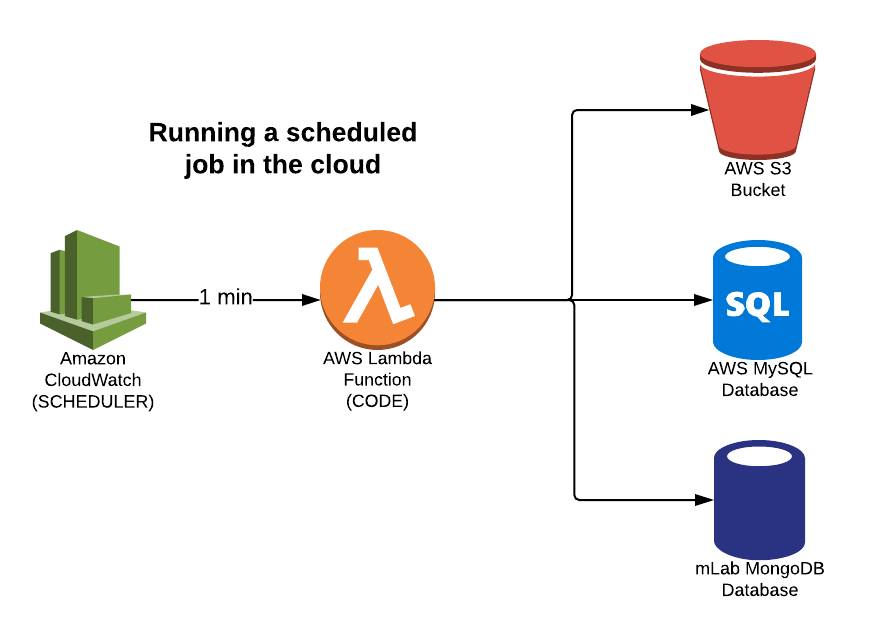

# Introduction to Amazon Web Services

### Benefits of Cloud Computing vs. Traditional IT Infrastructure
- Traditional (aka On-Premise): data center created and managed by your company (usually on-site)
- Cloud: data center provided by third-party (AWS, Azure, Google Cloud, etc.) - [AWS data center locations](https://aws.amazon.com/about-aws/global-infrastructure/)
    - Easy to use + flexible: can spin on a rented server in seconds
    - Cost-effective: don't have to purchase the servers and hire a team to setup everything
    - Reliable: little to no downtime
    - Scalable: able to handle millions of users no problem
    - Secure: limited network security issues
    - Potential cons: data security, not owning the servers, changing from on-prem to cloud


### Intro to Serverless Architecture
- Virtual server (EC2 instance): server you can rent in the cloud
- AWS Lambda: NO SERVERS! only pay for the time your code takes to run





#### Create our first Lambda function
1. Give your function a name
1. Use the Python 3.7 runtime
1. Ensure <i>Choose an existing role</i> is selected and choose the <b>lambda_demo</b> role
1. When done, click <b>Create function</b>


#### Upload code to Lambda
```
python -m venv venv
source venv/bin/activate
pip install requests boto3 pymongo
# add lambda_function to site-packages directory
# zip content inside site-packages directory
# upload zipped folder
```


### Infrastructure as Code
Renting and configuring servers and lambdas using code


#### Deploy a Lambda using the Serverless Framework
```
sls deploy            # build lambda
sls invoke -f runJob -l  # run function and show logged output
sls info              # get info on your lambda
sls remove            # delete lambda
```

### Cool Terminology
- Cloud computing: running and storing your code on a remote virtual server instead of a local server or personal computer (e.g. AWS, Heroku, etc.)
- EC2 instance: virtual server in the cloud
- Serverless architecture: cloud provider is responsible for executing your code by dynamically allocating the resources and only charging for the amount of resources used to run the code (e.g. AWS Lambda)
- Infrastructure as Code: managing cloud resources in a structured file instead of manually clicking through a UI (e.g. Serverless Framework)
